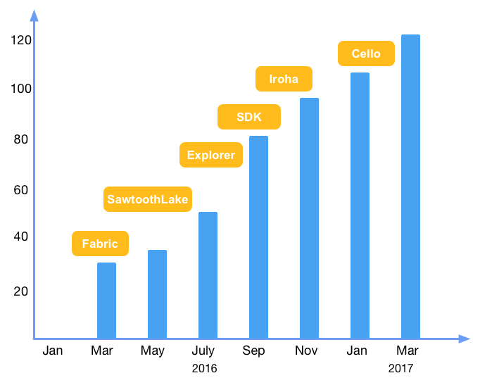

## 简介

### 历史
区块链已经成为当下最受人关注的开源技术，有人说它将颠覆金融行业的未来。然而对很多人来说，区块链技术难以理解和实现，而且缺乏统一的规范。

2015 年 12 月，开源世界的旗舰——[Linux 基金](http://www.linuxfoundation.org) 会牵头，联合 30 家初始企业成员（包括 IBM、Accenture、Intel、J.P.Morgan、R3、DAH、DTCC、FUJITSU、HITACHI、SWIFT、Cisco 等），共同 [宣告](https://www.hyperledger.org/news/announcement/2016/02/hyperledger-project-announces-30-founding-members) 了 [Hyperledger](https://www.hyperledger.org) 项目的成立。该项目试图打造一个透明、公开、去中心化的分布式账本项目，作为区块链技术的开源规范和标准，让更多的应用能更容易的建立在区块链技术之上。项目官方信息网站在 [hyperledger.org](https://www.hyperledger.org)，

目前已经有超过 120 家全球知名企业和机构（大部分均为各自行业的领导者）宣布加入 [Hyperledger](https://www.hyperledger.org/) 项目，其中包括 30 家来自中国本土的企业，包括艾亿新融旗下的艾亿数融科技公司（[2016.05.19](https://www.hyperledger.org/news/announcement/2016/05/hyperledger-project-announces-addition-eight-new-members)）、Onchain（[2016.06.22](https://www.hyperledger.org/news/announcement/2016/06/hyperledger-projects-maintains-strong-momentum-new-members)）、比邻共赢（Belink）信息技术有限公司（2016.06.22）、BitSE（2016.06.22）、布比（[2016.07.27](https://www.hyperledger.org/news/announcement/2016/07/hyperledger-project-has-welcomed-more-60-members-february)）、三一重工（[2016.08.30](https://www.hyperledger.org/news/announcement/2016/08/hyperledger-project-grows-170-percent-six-months)）、万达金融（[2016.09.08](https://www.hyperledger.org/announcements/2016/09/08/hyperledger-welcomes-wanda-as-premier-member)）、华为（[2016.10.24](https://www.hyperledger.org/announcements/2016/10/24/hyperledger-reaches-95-members-ahead-of-money2020)）等。

如果说以比特币为代表的货币区块链技术为 1.0，以以太坊为代表的合同区块链技术为 2.0，那么实现了完备的权限控制和安全保障的 Hyperledger 项目毫无疑问代表着 3.0 时代的到来。

IBM 贡献了数万行已有的 [Open Blockchain](https://github.com/openblockchain) 代码，Digital Asset 则贡献了企业和开发者相关资源，R3 贡献了新的金融交易架构，Intel 也刚贡献了跟分布式账本相关的代码。

Hyperledger 社区由技术委员会（Technical Steering Committee，TSC）指导，首任主席由来自 IBM 开源技术部 CTO 的 Chris Ferris 担任，管理组主席则由来自 Digital Asset Holdings 的 CEO Blythe Masters 担任。另外，自 2016 年 5 月起，Apache 基金会创始人 Brian Behlendorf 担任超级账本项目的首位执行董事。2016 年 12 月，[中国技术工作组](https://wiki.hyperledger.org/groups/tsc/technical-working-group-china) 正式成立，负责本土社区组织和技术引导工作。官方网站也提供了十分详细的 [组织结构信息](https://www.hyperledger.org/about/leadership)。

该项目的出现，实际上宣布区块链技术已经不再是仅面向“社会实验”性质的应用场景，它已经正式被主流机构和企业市场认可；同时，Hyperledger 首次提出和实现的完备权限管理、创新的一致性算法和可拔插、可扩展的框架，对于区块链相关技术和产业的发展都将产生深远的影响。

### 主要项目
代码托管在 [Gerrit](https://gerrit.hyperledger.org) 和 [Github](https://github.com/hyperledger/)（自动从 gerrit 上同步）上。

目前主要包括三大账本平台项目和若干其它项目。

账本平台项目：

* [Fabric](https://github.com/hyperledger/fabric)：包括 [Fabric](https://github.com/hyperledger/fabric)、[Fabric CA](https://github.com/hyperledger/fabric-ca)、Fabric SDK（包括 Node.Js、Python 和 Java 等语言）和 [fabric-api](https://github.com/hyperledger/fabric-api)、[fabric-sdk-node](https://github.com/hyperledger/fabric-sdk-node)、[fabric-sdk-py](https://github.com/hyperledger/fabric=sdk-py) 等，目标是区块链的基础核心平台，支持 pbft 等新的 consensus 机制，支持权限管理，最早由 IBM 和 DAH 发起；
* [SawToothLake](https://github.com/hyperledger/sawtooth-core)：包括 arcade、[core](https://github.com/hyperledger/sawtooth-core)、dev-tools、[validator](https://github.com/hyperledger/sawtooth-validator)、mktplace 等。是 Intel 主要发起和贡献的区块链平台，支持全新的基于硬件芯片的共识机制 Proof of Elapsed Time（PoET）。
* [Iroha](https://github.com/hyperledger/Iroha)：账本平台项目，基于 C++ 实现，带有不少面向 Web 和 Mobile 的特性，主要由 Soramitsu 发起和贡献。

其它项目：

* [Blockchain Explorer](https://github.com/hyperledger/blockchain-explorer)：提供 Web 操作界面，通过界面快速查看查询绑定区块链的状态（区块个数、交易历史）信息等。
* [Cello](https://github.com/hyperledger/cello)：提供"Blockchain as a Service" 功能，使用 Cello，管理员可以轻松获取和管理多条区块链；应用开发者可以无需关心如何搭建和维护区块链。

目前，所有项目均处于孵化（Incubation）状态。

### 项目原则
项目约定共同遵守的 [基本原则](https://github.com/hyperledger/hyperledger) 为：

* 重视模块化设计，包括交易、合同、一致性、身份、存储等技术场景；
* 代码可读性，保障新功能和模块都可以很容易添加和扩展；
* 演化路线，随着需求的深入和更多的应用场景，不断增加和演化新的项目。

如果你对 Hyperledger 的源码实现感兴趣，可以参考 [Hyperledger 源码分析之 Fabric](https://github.com/yeasy/hyperledger_code_fabric)。
